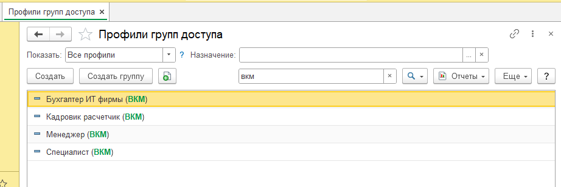

# Перед началом работы необходимо заполнить константы для отправки уведомлений в телеграмм и для заполнения номенклатур абонентского обслуживания. 
Форма константы располагается по пути «Обслуживание клиентов» ---> «Сервис» ---> «Форма констант (ВКМ) (см. рисунок 1). 
          
     			 Рисунок 1. Местонахождение формы констант (ВКМ)  
В форме констант (ВКМ) необходимо заполнить следующие реквизиты, отображенные на рисунке 2.  
  
     			 Рисунок 2. Форма констант (ВКМ)  
	[Заполнение констант и настройка регламентного задания для отправки уведомлений в телеграм](tasks/instrukciyaTelegram.md)   
Заполнение номенклатуры для абонентского обслуживания
Значение константы «Номенклатура абонентская плата» заводится в справочнике номенклатуры (см. рисунок 10).  
  
		Рисунок 10. Создание номенклатуры «Абонентская плата»  
	Значение константы «Номенклатура работы специалиста» создается аналогично (см. рисунок 10).  
	Настройка прав доступа пользователей
	Имеются поставляемые профили групп доступа для пользователей, следующие:  
    1. Для менеджеров назначается профиль групп «Менеджер (ВКМ)»;  
    2. Для специалистов назначается профиль групп «Специалист (ВКМ)»;  
    3. Для бухгалтера назначается профиль групп «Бухгалтер ИТ фирмы (ВКМ)»;  
    4. Для кадровика-расчетчика назначается профиль групп «Кадровик расчетчик (ВКМ)».  
Профили перечислены на рисунке 11.
  
		Рисунок 11. Поставляемые профили групп доступа  
